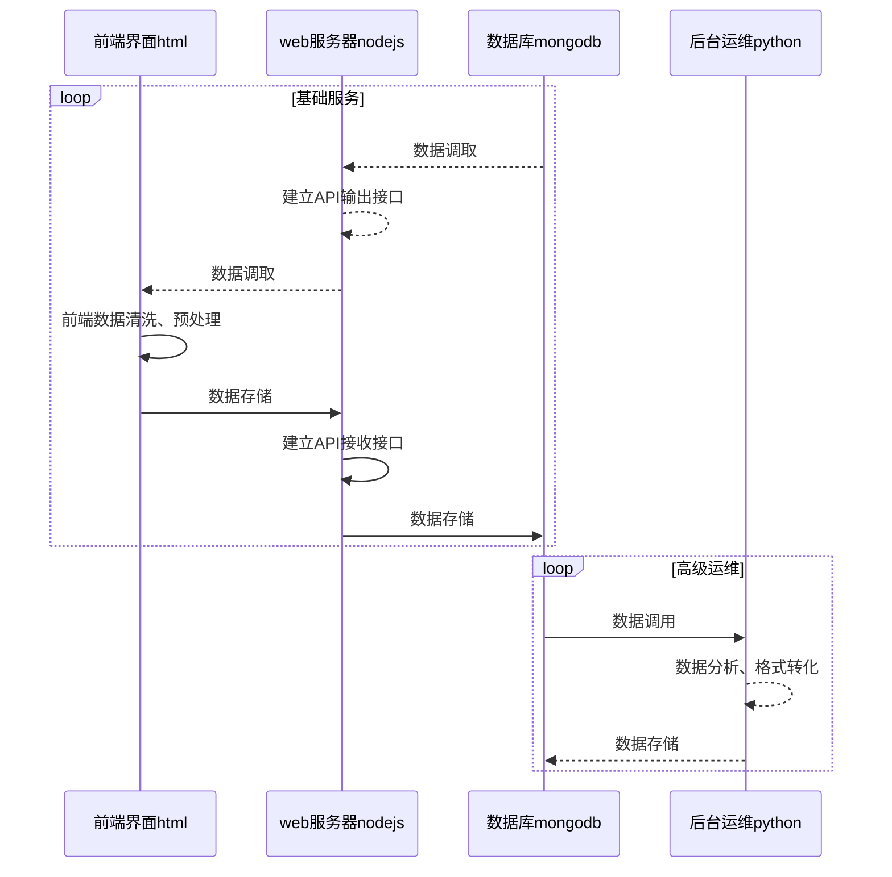

# AChoiceEcoSystems

#认识ACES

## 介绍

+ 全称：最优选择器`ActualChoice EcoSystems`
+ 简称：`ACES`
+ 用途：选择无处不在，`ACES`致力于帮助用户实现==***多样化***==选择，以及提供寻找==***最优解***==的各种方法。

## 架构

```mermaid
sequenceDiagram
participant 前端界面html
participant web服务器nodejs
participant 数据库mongodb
participant 后台运维python
loop 基础服务
数据库mongodb-->>web服务器nodejs:数据调取
web服务器nodejs-->>web服务器nodejs:建立API输出接口
web服务器nodejs-->>前端界面html:数据调取
前端界面html->>前端界面html:前端数据清洗、预处理
前端界面html->>web服务器nodejs:数据存储
web服务器nodejs->>web服务器nodejs:建立API接收接口
web服务器nodejs->>数据库mongodb:数据存储
end
loop 高级运维
数据库mongodb->>后台运维python:数据调用
后台运维python-->>后台运维python:数据分析、格式转化
后台运维python-->>数据库mongodb:数据存储
end
```
